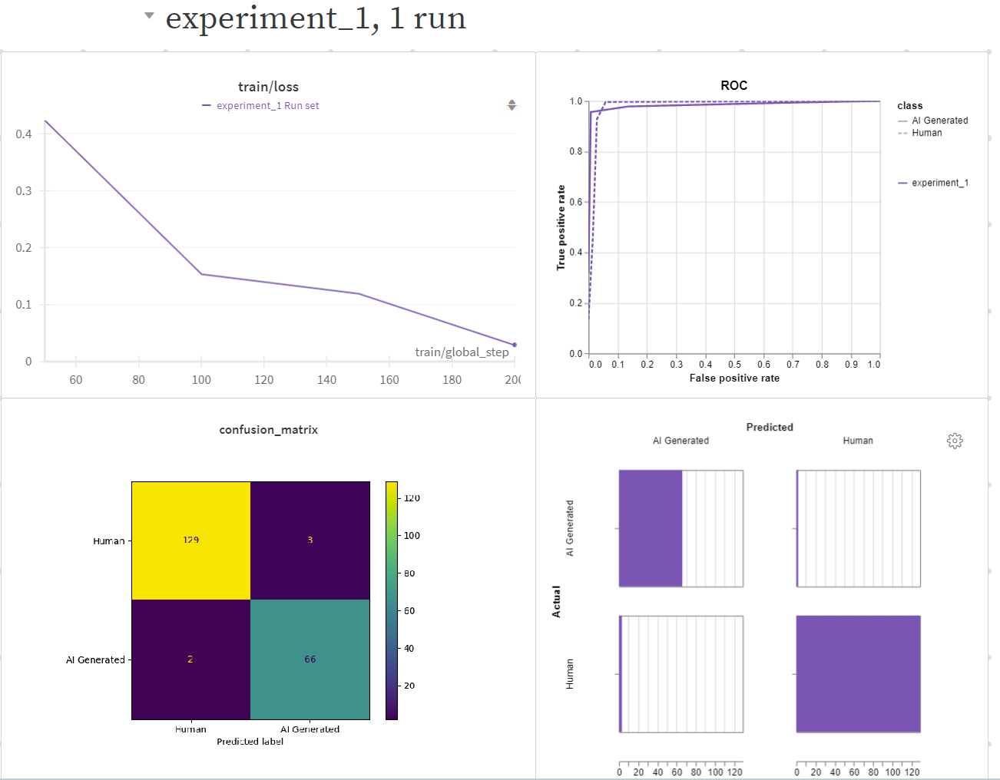
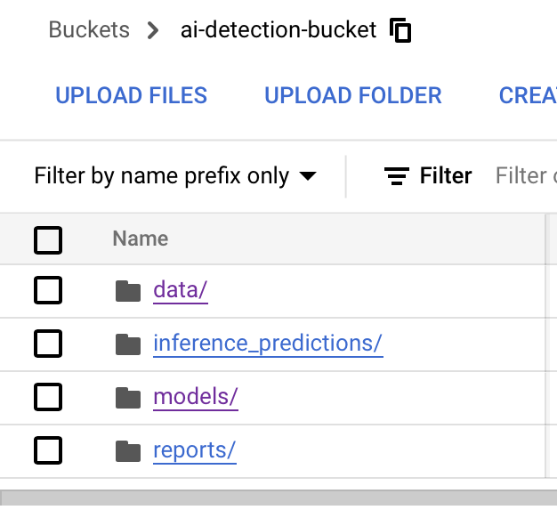
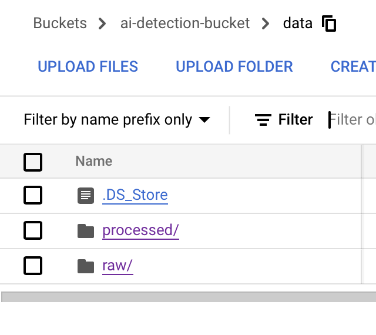
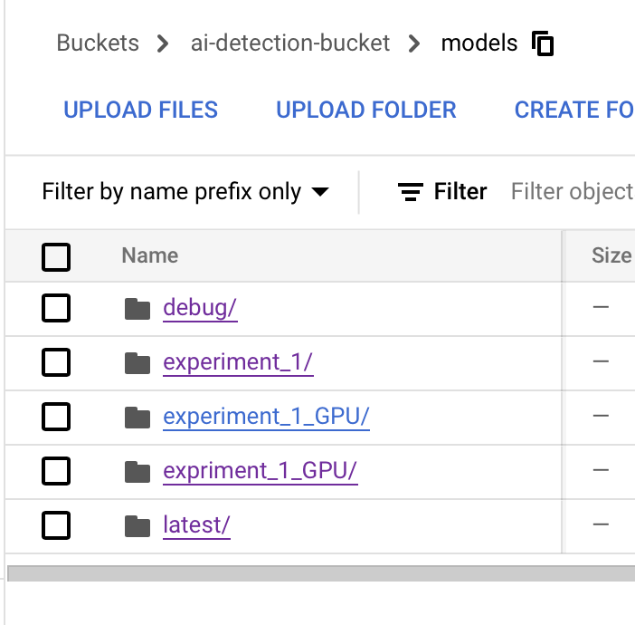
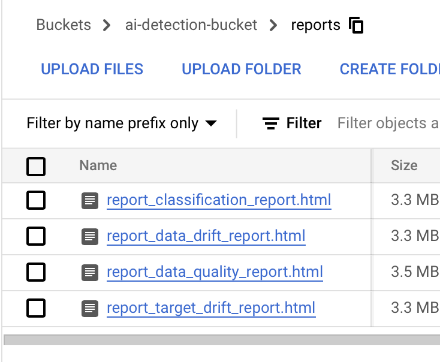
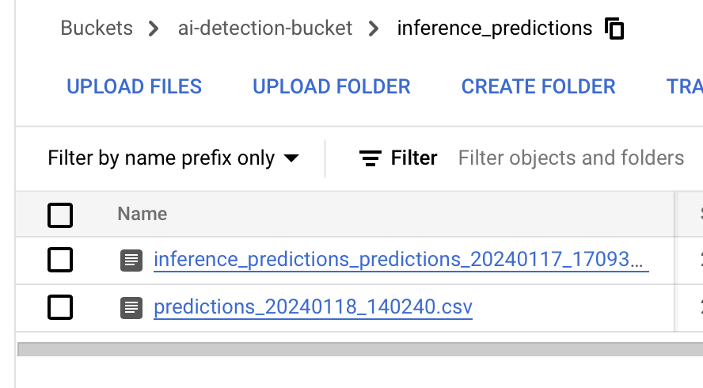
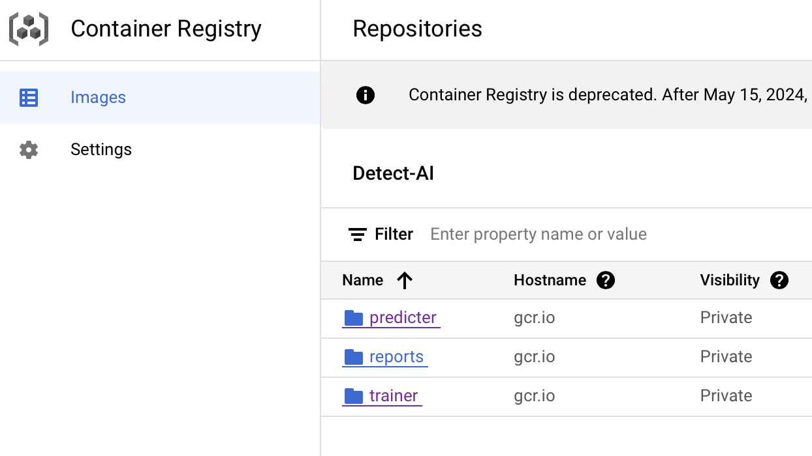
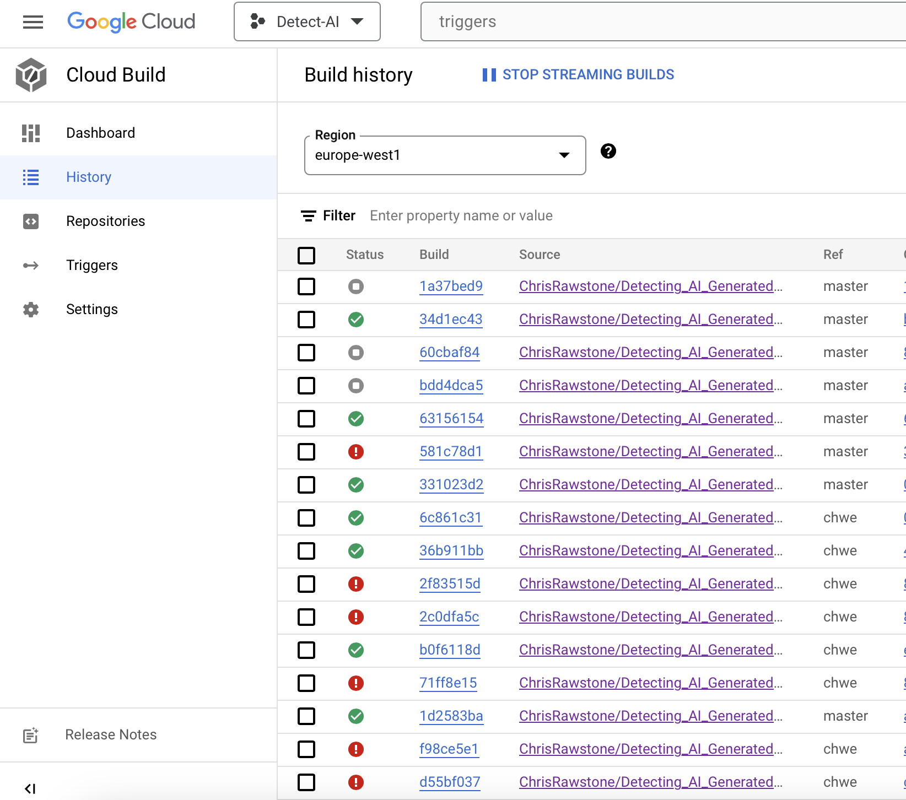
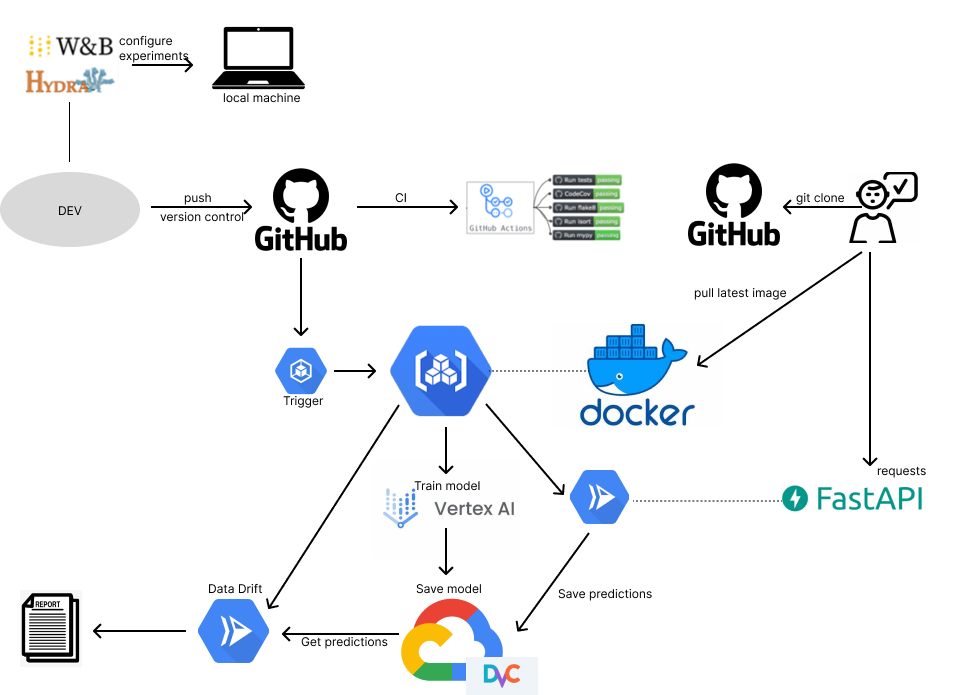

# Exam template for 02476 Machine Learning Operations

This is the report template for the exam. Please only remove the text formatted as with three dashes in front and behind
like:

```--- question 1 fill here ---```

where you instead should add your answers. Any other changes may have unwanted consequences when your report is auto
generated in the end of the course. For questions where you are asked to include images, start by adding the image to
the `figures` subfolder (please only use `.png`, `.jpg` or `.jpeg`) and then add the following code in your answer:

```markdown

```

In addition to this markdown file, we also provide the `report.py` script that provides two utility functions:

Running:

```bash
python report.py html
```

will generate an `.html` page of your report. After deadline for answering this template, we will autoscrape
everything in this `reports` folder and then use this utility to generate an `.html` page that will be your serve
as your final handin.

Running

```bash
python report.py check
```

will check your answers in this template against the constrains listed for each question e.g. is your answer too
short, too long, have you included an image when asked to.

For both functions to work it is important that you do not rename anything. The script have two dependencies that can
be installed with `pip install click markdown`.

## Overall project checklist

The checklist is *exhaustic* which means that it includes everything that you could possible do on the project in
relation the curricilum in this course. Therefore, we do not expect at all that you have checked of all boxes at the
end of the project.

### Week 1

* [X] Create a git repository
* [X] Make sure that all team members have write access to the github repository
* [X] Create a dedicated environment for you project to keep track of your packages
* [X] Create the initial file structure using cookiecutter
* [X] Fill out the `make_dataset.py` file such that it downloads whatever data you need and
* [X] Add a model file and a training script and get that running
* [X] Remember to fill out the `requirements.txt` file with whatever dependencies that you are using
* [X] Remember to comply with good coding practices (`pep8`) while doing the project
* [X] Do a bit of code typing and remember to document essential parts of your code
* [X] Setup version control for your data or part of your data
* [X] Construct one or multiple docker files for your code
* [X] Build the docker files locally and make sure they work as intended
* [X] Write one or multiple configurations files for your experiments
* [X] Used Hydra to load the configurations and manage your hyperparameters
* [ ] When you have something that works somewhat, remember at some point to to some profiling and see if
      you can optimize your code
* [X] Use Weights & Biases to log training progress and other important metrics/artifacts in your code. Additionally,
      consider running a hyperparameter optimization sweep.
* [X] Use Pytorch-lightning (if applicable) to reduce the amount of boilerplate in your code

### Week 2

* [X] Write unit tests related to the data part of your code
* [X] Write unit tests related to model construction and or model training
* [X] Calculate the coverage ().
* [X] Get some continuous integration running on the github repository
* [X] Create a data storage in GCP Bucket for you data and preferable link this with your data version control setup
* [X] Create a trigger workflow for automatically building your docker images
* [X] Get your model training in GCP using either the Engine or Vertex AI
* [X] Create a FastAPI application that can do inference using your model
* [ ] If applicable, consider deploying the model locally using torchserve
* [X] Deploy your model in GCP using either Functions or Run as the backend

### Week 3

* [X] Check how robust your model is towards data drifting
* [X] Setup monitoring for the system telemetry of your deployed model
* [X] Setup monitoring for the performance of your deployed model
* [ ] If applicable, play around with distributed data loading
* [ ] If applicable, play around with distributed model training
* [ ] Play around with quantization, compilation and pruning for you trained models to increase inference speed

### Additional

* [X] Revisit your initial project description. Did the project turn out as you wanted?
* [X] Make sure all group members have a understanding about all parts of the project
* [X] Uploaded all your code to github

## Group information

### Question 1
> **Enter the group number you signed up on <learn.inside.dtu.dk>**
>
> Answer:

69

### Question 2
> **Enter the study number for each member in the group**
>
> Example:
>
> *sXXXXXX, sXXXXXX, sXXXXXX*
>
> Answer:

*s204148, s204090, s204155, s204088*

### Question 3
> **What framework did you choose to work with and did it help you complete the project?**
>
> Answer length: 100-200 words.
>
> Example:
> *We used the third-party framework ... in our project. We used functionality ... and functionality ... from the*
> *package to do ... and ... in our project*.
>
> Answer:

For our NLP project, we chose to use the third-party framework: The Huggingface Transformers framework, which proved to be extremely beneficial. We used the pre-trained model from the framework, in particularly the DistilBert model from the transformers package. This model excels in text classification and allowed us to efficiently adapt it to our dataset. We also used the framework's Trainer and TrainingArguments classes to do efficient training of the model. These features simplified the typically complex training processes. Additionally, the integration of WandB for experiment monitoring and Google Cloud Storage for model management was compatible with the Transformers framework. In summary, the Transformers framework provided tools for model training and evaluation. We also used the framework to tokenize the text data and for the prediction.

## Coding environment

> In the following section we are interested in learning more about you local development environment.

### Question 4

> **Explain how you managed dependencies in your project? Explain the process a new team member would have to go**
> **through to get an exact copy of your environment.**
>
> Answer length: 100-200 words
>
> Example:
> *We used ... for managing our dependencies. The list of dependencies was auto-generated using ... . To get a*
> *complete copy of our development environment, one would have to run the following commands*
>
> Answer:

In our project, we used Conda to effectively manage the dependencis in our project application. The essential list of dependencies was first auto-generated through the `pipreqs` command, which compiled all necessary packages into the requirements.txt file. This file was then diligently uploaded to our GitHub repository for easy access and version control. Additionally, we manually included packages like DVC, ensuring they were accurately represented in our development environment. If a new team member were to replicate our environment, they would simply need to execute a series of straightforward commands in a fresh Python 3.11 environment. Initially, they should create a new Conda environment using `conda create -n detectai python=3.11`, followed by activating it with `conda activate detectai`. The final step involves installing all required dependencies using `pip install -r requirements.txt`. This process guarantees a consistent and fully functional development setup, which would be an exact copy of our original environment.

### Question 5

> **We expect that you initialized your project using the cookiecutter template. Explain the overall structure of your**
> **code. Did you fill out every folder or only a subset?**
>
> Answer length: 100-200 words
>
> Example:
> *From the cookiecutter template we have filled out the ... , ... and ... folder. We have removed the ... folder*
> *because we did not use any ... in our project. We have added an ... folder that contains ... for running our*
> *experiments.*
> Answer:

Using the cookiecutter template for the mlops course, we have filled out the `.github/workflows`, `data`, `dockerfiles`, `reports` and `tests` folders. We have not filled out the docs folder but documentation for running the application is added in the READme file. The notebook folder have we not used for the final project. The source code is contained in the `src` folder. We have added the folders `outputs` which contains the logs of the train models and the folder `results` to store the predictions from the model. We did not fill out the src/models folder as we are using a pretrained model from the transformer framework. We have added scripts to the `data` folder and the `visualization` folder.

### Question 6

> **Did you implement any rules for code quality and format? Additionally, explain with your own words why these**
> **concepts matters in larger projects.**
>
> Answer length: 50-100 words.
>
> Answer:

In our project, we implemented code quality and formatting rules following PEP8 for Python coding standards. Additionally, we used the tool Ruff for formatting the code. These rules ensure consistency in code style and help in identifying potential errors early. In large projects it is important to follow the PEP8 pratice as it enhances readability and maintainability. When we are more people involved in developing code, it ensures that everyone follows the same standards, making the codebase easier to understand and later on modify.

## Version control

> In the following section we are interested in how version control was used in your project during development to
> corporate and increase the quality of your code.

### Question 7

> **How many tests did you implement and what are they testing in your code?**
>
> Answer length: 50-100 words.
>
> Example:
> *In total we have implemented X tests. Primarily we are testing ... and ... as these the most critical parts of our*
> *application but also ... .*
>
> Answer:

In total we have implemented 4 tests. We are testing data processing with two tests as well as testing the training and the prediction of a model. The most critical part of our application was to test that the model trains and saves a model. Because we are using the framework Transformer we expect that the framework are in charge of testing that the model works correctly. Thereby, we don't do additional testing here but focus on testing that our application outputs the correct from the different files. We have written our unit tests, using the `pytest` package where we utilized both pytest.raises or assert statements.

### Question 8

> **What is the total code coverage (in percentage) of your code? If you code had an code coverage of 100% (or close**
> **to), would you still trust it to be error free? Explain you reasoning.**
>
> Answer length: 100-200 words.
>
> Example:
> *The total code coverage of code is X%, which includes all our source code. We are far from 100% coverage of our **
> *code and even if we were then...*
>
> Answer:

The total code coverage of our application is 40%. We are far from 100% coverage of our code, because we primarily focused on testing our source code, excluding making unit tests on the framework. Even if we were close to a 100% code coverage this would still not be an absolute indicator that our codebase was totally bug-free. High coverage can give a false sense of security, as it doesn't always cover edge cases or guarantee test quality. Our testing strategy aimed for testing critical functionalities like accurate data handling, model training, and prediction formatting. These were areas that our codebase handles so this is what is vital for our application to test.

### Question 9

> **Did you workflow include using branches and pull requests? If yes, explain how. If not, explain how branches and**
> **pull request can help improve version control.**
>
> Answer length: 100-200 words.
>
> Example:
> *We made use of both branches and PRs in our project. In our group, each member had an branch that they worked on in*
> *addition to the main branch. To merge code we ...*
>
> Answer:

In our project we made use of branches as each member in our group had a branch. We also employed a "develop" branch as an intermediate stage before integrating changes into the master branch. The process involved that all team members merged their updates to the develop branch. Throughout the project, when we confirmed everything was functioning correctly, we merged the develop branch into the master branch. We did not make use of pull requests primarily due to the scale and collaborative style of our team. Being a relatively small team of four people allowed us to directly communicate and get immediate feedback on our code. This setup enabled us to discuss and implement changes without the need for the formal review process typically associated with pull requests. However, in larger projects or in environments with distributed teams, we can see that pull requests can be incredibly beneficial. They provide a structured way to review and discuss proposed changes, ensure code quality, and maintain a history of decisions and modifications. Additionally the use of pull requests can be used to make sure that all code going into production (master branch) is reviewed.

### Question 10

> **Did you use DVC for managing data in your project? If yes, then how did it improve your project to have version**
> **control of your data. If no, explain a case where it would be beneficial to have version control of your data.**
>
> Answer length: 100-200 words.
>
> Example:
> *We did make use of DVC in the following way: ... . In the end it helped us in ... for controlling ... part of our*
> *pipeline*
>
> Answer:

We did use DVC in our project, which is connected to Google Cloud Storage to store data. DVC was included for its version control capabilities and to ensure that all data we were handling was consistently up to date. It required a careful balance to track changes effectively on GCS while leveraging DVC’s features. Despite these initial complexities, DVC could be used to played a crucial role in managing our datasets, especially for storing different versions of the dataset, small in size, all data as well as storing tokenized version of the data. We used the version control so that all team members could quickly be up to date using the same data. It wasn't a smooth start, but DVC eventually became an integral part of our data management strategy.

### Question 11

> **Discuss you continues integration setup. What kind of CI are you running (unittesting, linting, etc.)? Do you test**
> **multiple operating systems, python version etc. Do you make use of caching? Feel free to insert a link to one of**
> **your github actions workflow.**
>
> Answer length: 200-300 words.
>
> Example:
> *We have organized our CI into 3 separate files: one for doing ..., one for running ... testing and one for running*
> *... . In particular for our ..., we used ... .An example of a triggered workflow can be seen here: <weblink>*
>
> Answer:

We have organized our CI in just one file. We are doing unittesting with one workflow that will test both data handling, loading a trained model and checking the format of the saved predictions is as expected. The workflow is triggered when pushing to the master branch. As we intended, our workflow should do immediate testing of updates which would prevent potential errors from impacting the stability of the project without us catching the error early on with our tests. An example of our triggered workflow can be seen here on Github actions: <https://github.com/ChrisRawstone/Detecting_AI_Generated_Text/actions>. The tests can also be called locally. We have strived to give good warnings and error messages such as "remember to pull from DVC" if a required dataset is not present on a team member's computer and therefore the training of the model cannot be executed.

## Running code and tracking experiments

> In the following section we are interested in learning more about the experimental setup for running your code and
> especially the reproducibility of your experiments.

### Question 12

> **How did you configure experiments? Did you make use of config files? Explain with coding examples of how you would**
> **run a experiment.**
>
> Answer length: 50-100 words.
>
> Example:
> *We used a simple argparser, that worked in the following way: python my_script.py --lr 1e-3 --batch_size 25*
>
> Answer:

We configured our experiments by using the Hydra configuration tool. In the src/config folder we placed config files with the aim of structuring the hyperparameters of our model in a reproducible way. This means that when using this kind of setup we can easily configure our experiment and systematically save the hyperparameters along with the experiments. A way to run an experiment is:
`python train_model.py experiment = experiment_1`. Here, the config file is called experiment_1 and the model and Wandb will also be save as experiment_1, so we can keep track of experiments, model and logs. The default config file has experiment set to debug_hparams.

### Question 13

> **Reproducibility of experiments are important. Related to the last question, how did you secure that no information**
> **is lost when running experiments and that your experiments are reproducible?**
>
> Answer length: 100-200 words.
>
> Example:
> *We made use of config files. Whenever an experiment is run the following happens: ... . To reproduce an experiment*
> *one would have to do ...*
>
> Answer:

As said, we made use of config files. When we want to run a new experiment we first define the exact setup of the hyperparameters we want to test in a new config file. This step is important as it establishes a clear and consistent way for us to conduct each experimental run. Then we can move on to training the model. To reproduce an experiment we can simply use any previously defined config file. This method secures that no information is lost when running experiments and that our experiments are reproducible. The performance of each model configuration and training is furthermore saved to Weights and Biases.

### Question 14

> **Upload 1 to 3 screenshots that show the experiments that you have done in W&B (or another experiment tracking**
> **service of your choice). This may include loss graphs, logged images, hyperparameter sweeps etc. You can take**
> **inspiration from [this figure](figures/wandb.png). Explain what metrics you are tracking and why they are**
> **important.**
>
> Answer length: 200-300 words + 1 to 3 screenshots.
>
> Example:
> *As seen in the first image when have tracked ... and ... which both inform us about ... in our experiments.*
> *As seen in the second image we are also tracking ... and ...*
>
> Answer:



In our project, we used Weights and Biases to track key metrics like training loss, ROC curves, confusion matrices, and predicted vs. actual labels. Monitoring the training loss helped us understand our model's learning progress - although we should have plotted the validation loss along side to check for overfitting. The ROC curve was crucial for assessing the trade-offs in classification performance at different thresholds. The confusion matrix provided clear insights into correct and incorrect predictions, highlighting potential biases or weaknesses in our model. Comparing predicted and actual labels allowed us to directly observe and fine-tune our model's predictions. If we further should have optimized our model we could look more into these metrics.

### Question 15

> **Docker is an important tool for creating containerized applications. Explain how you used docker in your**
> **experiments? Include how you would run your docker images and include a link to one of your docker files.**
>
> Answer length: 100-200 words.
>
> Example:
> *For our project we developed several images: one for training, inference and deployment. For example to run the*
> *training docker image: `docker run trainer:latest lr=1e-3 batch_size=64`. Link to docker file: <weblink>*
>
> Answer:

For our project, we developed three distinct images, each serving a specialized purpose. The first is designed for training, responsible for training the model and logging to WandB for effective monitoring. To initiate this training image, one can either kickstart the process by executing the submit_vertex_job.py script or, if running locally, fire up the Docker container using the command docker run -e WANDB_API_KEY=<API_KEY_HERE> trainer:latest. Here is the dockerfile used to build the train image: <https://github.com/ChrisRawstone/Detecting_AI_Generated_Text/blob/master/dockerfiles/train_model.dockerfile>. The second image, tailored for deployment, takes the trained model and facilitates its deployment, making it ready for real-time predictions. This is achieved by launching Cloud Run, leveraging the capabilities of FASTAPI to ensure smooth and responsive deployment. Lastly, our third Docker image is for data drift analysis. This image, also hosted on Cloud Run using FASTAPI, generates insightful reports based on predictions stored in the bucket. Clicking on Cloud Run triggers the creation of these reports, providing valuable insights into the model's performance and any potential drift. All Docker images are seamlessly built and orchestrated within the Google Cloud environment, offering a streamlined and efficient workflow for training, deploying, and analyzing the performance of our machine learning model.

### Question 16

> **When running into bugs while trying to run your experiments, how did you perform debugging? Additionally, did you**
> **try to profile your code or do you think it is already perfect?**
>
> We used debugging extensively everytime we had a bug locally. When we were confronted on a bug. 
>
> Answer:

We employed debugging extensively throughout our project whenever we encountered bugs, both locally and in the cloud or virtual machine environments. Each time a bug arose, we began by analyzing the error message. If the message wasn't clear enough, we utilized the built-in debugger tool or the great tool of print-statemento systematically trace through the lines and functions we suspected might be causing the issue. We acknowledge that our code is neither perfectly written nor fully optimized. To improve efficiency, we focused on optimizing our code in specific areas, such as managing our model more effectively. Instead of repeatedly saving and loading the model in an unstructured manner, we optimized by loading and using it directly from memory, which enhanced the code's performance and reduced unnecessary overhead. 

## Working in the cloud

> In the following section we would like to know more about your experience when developing in the cloud.

### Question 17

> **List all the GCP services that you made use of in your project and shortly explain what each service does?**
>
> Answer length: 50-200 words.
>
> Example:
> *We used the following two services: Engine and Bucket. Engine is used for... and Bucket is used for...*
>
> Answer:

In our project, we used a variety of Google Cloud Platform (GCP) services, each tailored to meet specific needs in or project pipeline. Compute Engine - used to create Virtual Machines that deployed containers based on our training image. Cloud Stoage - used fo store our data, model, predictions and reports for data drift in a well-organized bucket. Vertex AI - played a crucial role in training our model. Cloud Build - for building our images (train, predictions and data drift). Cloud Run - for deployment of our model and data drifting.

### Question 18

> **The backbone of GCP is the Compute engine. Explained how you made use of this service and what type of VMs**
> **you used?**
>
> Answer length: 100-200 words.
>
> Example:
> *We used the compute engine to run our ... . We used instances with the following hardware: ... and we started the*
> *using a custom container: ...*
>
> Answer:

We utilized a GPU compute engine equipped with T4 GPUs, essential for tasks demanding CUDA GPU capabilities. This powerful setup was crucial for debugging processes that required GPU acceleration. Furthermore, the compute engine played a pivotal role in large-scale model training, a task unfeasible on our local machines. The high-performance hardware significantly accelerated our training processes. What would typically take 30 hours on standard setups was remarkably reduced to just 1.5 hours, showcasing the efficiency and power of the compute engine in handling intensive computational tasks. If we had more time we would have liked to experiment with running docker files with GPU as this would be perfect practice for deploying a docker with GPU in the real world.

### Question 19

> **Insert 1-2 images of your GCP bucket, such that we can see what data you have stored in it.**
> **You can take inspiration from [this figure](figures/bucket.png).**
>
> Answer:

We have one bucket with multiple folders: data, models, reports and predictions. 







Our Data in GCS is version controlled using DVC. 

### Question 20
> **Upload one image of your GCP container registry, such that we can see the different images that you have stored.**
> **You can take inspiration from [this figure](figures/registry.png).**
>
> Answer:

-

### Question 21

> **Upload one image of your GCP cloud build history, so we can see the history of the images that have been build in**
> **your project. You can take inspiration from [this figure](figures/build.png).**
>
> Answer:




### Question 22

> **Did you manage to deploy your model, either in locally or cloud? If not, describe why. If yes, describe how and**
> **preferably how you invoke your deployed service?**
>
> Answer length: 100-200 words.
>
> Example:
> *For deployment we wrapped our model into application using ... . We first tried locally serving the model, which*
> *worked. Afterwards we deployed it in the cloud, using ... . To invoke the service an user would call*
> *`curl -X POST -F "file=@file.json"<weburl>`*
>
> Answer:

We successfully deployed  our model both on local systems and in the cloud. Initially, we set up the model locally to facilitate rapid debugging. We then used cloud run to deploy it in the cloud. We focused more on a small interactive webpage rather that setting up api calls. A use could go to our hosted website to access the application and predict whether a chosen string or a csv file containing texts is human written or written by AI:
<https://predicter-qkns26jbea-ew.a.run.app/>

### Question 23

> **Did you manage to implement monitoring of your deployed model? If yes, explain how it works. If not, explain how**
> **monitoring would help the longevity of your application.**
>
> Answer length: 100-200 words.
>
> Example:
> *We did not manage to implement monitoring. We would like to have monitoring implemented such that over time we could*
> *measure ... and ... that would inform us about this ... behaviour of our application.*
>
> Answer:

In our project, we implemented monitoring for our deployed model, focusing mostly on data drifting and a little on system performance. We used Evidently AI for data monitoring, particularly for tracking data drifting. This allowed us to monitor changes in data distribution, ensuring our model's ongoing accuracy with new data. Over time, we could have used our data drifting reports to proactively maintain the model performance for evolving data patterns. For system monitoring (telemetry), we loosely experimented with setting up Google Cloud Storage alerts and Service Level Objectives (SLOs). Over time the alerts would have kept us informed of critical events or anomalies in our data storage system, enabling quick responses to potential issues. The key would have been to balance making the right amount of alerts of the most critical issues. For longterm health of our application it would be a good idea to do at least more system monitoring.

### Question 24

> **How many credits did you end up using during the project and what service was most expensive?**
>
> Answer length: 25-100 words.
>
> Example:
> *Group member 1 used ..., Group member 2 used ..., in total ... credits was spend during development. The service*
> *costing the most was ... due to ...*
>
> Answer:

In total we used $45. We tried to limit our spendings such that we did exceed the gifted educational billing account. However, we did later find it was quite easy to change billing account for a project. The most of the credits were spend on storage and on using the compute engine. A substantial portion of our expenses was allocated to Google Storage. This was primarily due to the construction of numerous containers, each averaging around 3 GB in size, which we learned that we should remember to delete if not used. 

### Question 25

> **Include a figure that describes the overall architecture of your system and what services that you make use of.**
> **You can take inspiration from [this figure](figures/overview.png). Additionally in your own words, explain the**
> **overall steps in figure.**
>
> Answer length: 200-400 words
>
> Example:
>
> *The starting point of the diagram is our local setup, where we integrated ... and ... and ... into our code.*
> *Whenever we commit code and puch to github, it auto triggers ... and ... . From there the diagram shows ...*
>
> Answer:

In our system's architecture, development begins locally where we integrate Hydra for dynamic configuration and Weights & Biases for experiment tracking. Code commits to the master branch will trigger GitHub Actions for continuous integration and running tests. Docker containers encapsulate our environment, ensuring consistency. Training occurs on Vertex AI, leveraging cloud scalability for machine learning tasks. Model and data versioning are handled by DVC, ensuring reproducibility while our data is stored on GCP. The architecture culminates in deployment via FastAPI, providing a responsive website hosted through cloud. 



### Question 26

> **Discuss the overall struggles of the project. Where did you spend most time and what did you do to overcome these**
> **challenges?**
>
> Answer length: 200-400 words.
>
> Example:
> *The biggest challenges in the project was using ... tool to do ... . The reason for this was ...*
>
> Answer:

The primary challenges encountered during the project revolved around the utilization of DVC (Data Version Control). This tool caused significant technical challenges, manifesting in various issues that delayed our progress. Additionally, the integration of Hydra with WandB Sweep for hyperparameter tunning proved to be a challenging task, and despite our efforts, we were unable to successfully execute it. It's worth noting that this aspect was not deemed a top priority at the time, why we didn't put much effort to make it work. Another noteworthy difficulty appeared in configuring the Vertex WandB key ID. Initially, attempts to set it through the args statement proved to not be possible, prompting us to explore alternative solutions. Eventually, a workaround was implemented in the form of a script utilizing argparser to successfully handle the WandB key ID. To streamline our workflow and avoid further challenges, a decision was made to make our storage bucket public. This strategic move aimed to avoid the complexities associated with authentication processes that would have otherwise demanded considerable time and resources.

### Question 27

> **State the individual contributions of each team member. This is required information from DTU, because we need to**
> **make sure all members contributed actively to the project**
>
> Answer length: 50-200 words.
>
> Example:
> *Student sXXXXXX was in charge of developing of setting up the initial cookie cutter project and developing of the*
> *docker containers for training our applications.*
> *Student sXXXXXX was in charge of training our models in the cloud and deploying them afterwards.*
> *All members contributed to code by...*
>
> Answer:

All memebers in the group have equally contributed to the project, where most tasks where developed in pairs of two or more. CI & Unit testing: s204088, s204090. Model training: s204155, s204148. Model Deployment: s204090, s204148. Data Drifting: s204090, s204155, s204088.